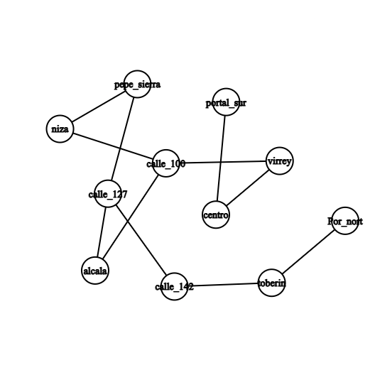

## 1. Ejercicio

Tu tarea: Implementa una función ruta_minima(grafo, origen, destino) usando BFS que retorne la lista de estaciones del recorrido más corto (menor número de paradas) entre dos estaciones. Si no existe camino, retorna None.

Grafo de prueba:

Python — metro.py (plantilla)
metro = {
    "Portal Norte":   ["Toberín"],
    "Toberín":        ["Portal Norte", "Calle 142"],
    "Calle 142":      ["Toberín", "Calle 127"],
    "Calle 127":      ["Calle 142", "Pepe Sierra", "Alcalá"],
    "Pepe Sierra":    ["Calle 127", "Niza"],
    "Alcalá":         ["Calle 127", "Calle 100"],
    "Niza":           ["Pepe Sierra", "Calle 100"],
    "Calle 100":      ["Alcalá", "Niza", "Virrey"],
    "Virrey":         ["Calle 100", "Centro"],
    "Centro":         ["Virrey", "Portal Sur"],
    "Portal Sur":     ["Centro"],
}

# TU SOLUCIÓN AQUÍ:
def ruta_minima(grafo, origen, destino):
    # Pista: usa BFS con seguimiento del camino
    pass

# Prueba:
print(ruta_minima(metro, "Portal Norte", "Centro"))
# Esperado: ['Portal Norte', 'Toberín', 'Calle 142',
#            'Calle 127', 'Alcalá', 'Calle 100', 'Virrey', 'Centro']#

# 2. Ejercicio Arbol binario de busqueda

🏆 Torneo Deportivo (BST)
Eres el sistema de ranking de un torneo de e-sports. Los jugadores tienen puntuaciones y necesitas un BST para gestionar las búsquedas eficientemente.

Tu tarea: Partiendo del BST implementado en la sección de código, agrega tres métodos:

# a minimo() — Retorna el jugador con menor puntuación.
# b maximo() — Retorna el jugador con mayor puntuación.
# c top_n(n) — Retorna los N jugadores con mayor puntuación.

Python — torneo.py (plantilla)
# Usa la clase BST del ejemplo anterior y agrégale:

class BST:
    # ... (código anterior) ...

    def minimo(self):
        # Pista: el mínimo está siempre en el extremo izquierdo
        pass

    def maximo(self):
        # Pista: el máximo está siempre en el extremo derecho
        pass

    def top_n(self, n):
        # Pista: InOrder da orden ascendente. ¿Cuál da descendente?
        pass

# Prueba:
torneo = BST()
puntos = [3200, 4100, 1800, 5000, 2700, 3900, 4600]
for p in puntos:
    torneo.insertar(p)

print("Mínimo:", torneo.minimo())    # → 1800
print("Máximo:", torneo.maximo())    # → 5000
print("Top 3:",  torneo.top_n(3))    # → [5000, 4600, 4100]
